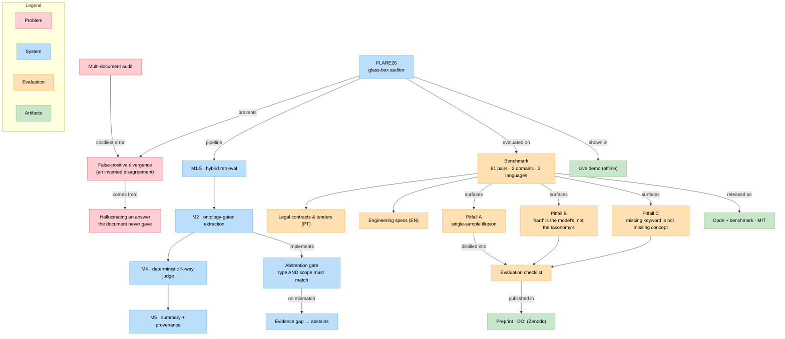
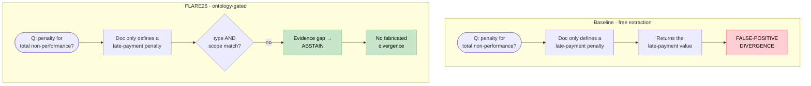
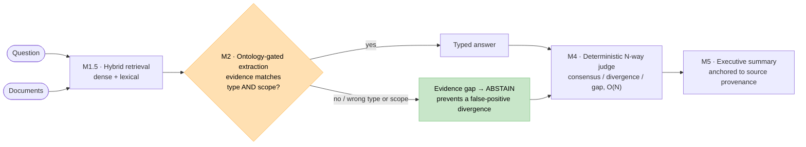

# FLARE26 — Ontology-Gated Abstention for Document Audit

[](https://doi.org/10.5281/zenodo.20881699)
[](LICENSE)
[](https://flare26-p1-j5gahqx45gwp7h4ksdohxn.streamlit.app/)

**A neuro-symbolic "glass-box" auditor that compares documents and knows when *not* to answer.**

▶️ **[Live demo](https://flare26-p1-j5gahqx45gwp7h4ksdohxn.streamlit.app/)** (zero-cost, offline) — explore the benchmark and the baseline-vs-FLARE result, no API key needed.

FLARE26 extracts a typed answer from each document, **abstains** when the
requested information is genuinely absent or of the wrong *type/scope*, and then
decides consensus vs. divergence across documents with a **deterministic** judge.
The goal is to avoid the most expensive error in multi-document audit: a
**false-positive divergence** — a disagreement the system *invents* by
hallucinating an answer that the document never gave.

> **Honest framing.** This is an applied / systems project plus an empirical
> study, not a new ML method. Its value is in the architectural pattern
> (*abstention as a pre-condition for comparison*) and in an evaluation that is
> reported transparently, including its negative results and limitations.

---

## Project map (knowledge graph)

A bird's-eye view of how the problem, the system, the evaluation, and the
released artifacts connect.



The four colors group the layers — problem, system, evaluation, released
artifacts — as shown in the **Legend** box inside the graph.

---

## Key result (synthetic benchmark, 30 pairs)

Extractor: `gpt-4o-mini`, temperature 0, fixed seed. Mean ± std.

| System | False-positive ↓ | Answer recall ↑ |
|--------|------------------|-----------------|
| Baseline (free extraction) | 38% ± 0% | 100% ± 0% |
| FLARE26 (ontology-gated)   | **~1–2%** | 81% ± 6% |
| FLARE26 + self-consistency (k=10, t=4) | **~0%** | 80% |

**Why the gap?** Same question, same document — only the gate differs:



Ontological gating cuts the false-positive divergence rate **~20–30×** vs. the
baseline. Self-consistency exposes a tunable recall × precision operating curve
(a **majority-style vote** keeps false positives near zero). See
[`paper/draft.md`](paper/draft.md) §4.

**A real-document pilot** (10 labeled pairs from real Brazilian government
procurement documents) is preliminary and discussed in §4.3–4.4 and §6 — chiefly
that *reliable absence annotation* on real legal text (keyword-absence ≠
concept-absence) is the binding constraint.

---

## How it works



*The whole point is the **M2 gate**: when the retrieved evidence does not match
the question's type **and** scope, the system emits an explicit **evidence gap**
instead of hallucinating an answer — which is what stops a fabricated
(false-positive) divergence downstream.*

| Module | Role |
|--------|------|
| **M1.5** | Hybrid retrieval (dense vectors + lexical), parent/child chunking |
| **M2**   | **Ontology-gated extraction** — answers only if the evidence matches the question's *type* **and** *scope*; otherwise emits an explicit *evidence gap* |
| **M4**   | **Deterministic N-way judge** — groups documents by equivalent answer (BR number normalization), verdict in O(N), no LLM call |
| **M5**   | Executive summary, anchored to the judge's typed output |

The compatibility rule is **domain-agnostic** (stated over abstract instruments
P/Q and conditions A/B — no hard-coded legal terms).

## Repository layout

```
flare26_core.py        # Pure, tested logic (number normalization, judges) — no Streamlit/OpenAI
flare26_pipeline.py    # Headless RAG (M1.5/M2) — callable without a UI
app_flare26_pdf.py     # Streamlit "glass-box" app (UI shell over the pipeline)
tests/                 # pytest suite (42 tests; regression over a ledger snapshot)
eval/                  # Benchmark + reproducible evaluation harnesses (see eval/README.md)
  gold_dataset.json    #   61 verified (question, document) pairs, two domains/two languages
  run_eval*.py         #   metrics, k-repetition, (k,t) vote sweep, recall×cost curve
paper/                 # Paper draft (Markdown + LaTeX), references, build script
documentos/            # Sample contracts and tender notices (PDF)
```

## Quick start

Requires Python 3.11+ (developed on 3.14) and an OpenAI API key.

```bash
python -m venv .venv && source .venv/bin/activate
pip install -r requirements.txt

# --- run the tests (no API key needed) ---
python -m pytest tests/ -q

# --- run the evaluation (needs OPENAI_API_KEY) ---
export OPENAI_API_KEY=sk-...
python eval/run_eval.py                  # baseline vs FLARE26 on the gold set
FLARE_CONSENSO=5 python eval/run_eval.py # with self-consistency

# --- run the interactive app ---
echo 'OPENAI_API_KEY = "sk-..."' > .streamlit/secrets.toml
streamlit run app_flare26_pdf.py
```

## Benchmark

The evaluation benchmark ([`eval/gold_dataset.json`](eval/gold_dataset.json)) has
**61 verified** `(question, document)` pairs across **two domains and two
languages** — Brazilian legal contracts and tender notices (Portuguese: 30
synthetic + 10 real) and English reliability/mechanical engineering specs (21) —
each labeled with the correct answer **or** `ABSTAIN`. It deliberately includes
*discriminating* cases — e.g. *interest ≠ penalty*, *warranty term ≠ payment
term*, *MTBF ≠ MTTR*, *tensile ≠ yield* — where a naive extractor may
hallucinate. See [`eval/README.md`](eval/README.md) for the annotation protocol.

## Status & limitations (read this)

- The strong result is on a **small, synthetic** benchmark (30 pairs).
  Error bars on a ~1–2% false-positive rate are wide.
- The gate **leaks rarely** (it is not a 0% guarantee); the defensible claim is
  the large reduction vs. baseline.
- The gate helps **only where the baseline actually leaks** (model-confusable
  concept pairs). In crisp domains it adds no measurable benefit — the 21-case
  engineering split shows the baseline already abstains (0% false positives). See
  paper §4.3 ("*hard* is the model's, not the taxonomy's").
- **Real-document external validity is not established.** The binding constraint
  is domain-grade *absence* annotation; this is the priority next step.
- Depends on a proprietary LLM (`gpt-4o-mini`); open-model replication is future
  work.
- The synthetic headline exercises the **gate, not retrieval**: short documents
  (< 80k chars) take a *full-context bypass* (M1.5 ranking is skipped and the
  whole text goes to the extractor). The retrieval fix (§4.5) only matters for
  large real documents.

## Paper

The preprint **"When the Baseline Also Abstains: Pitfalls in Evaluating
Abstention for Document Audit"** is published on Zenodo (CC BY 4.0):
**[doi:10.5281/zenodo.20881699](https://doi.org/10.5281/zenodo.20881699)**.
Source (Markdown + LaTeX) and the compiled PDF are in [`paper/`](paper/).
Regenerate the reading PDF with:

```bash
python paper/md_to_html.py paper/draft.md /tmp/draft.html
soffice --headless --convert-to pdf --outdir paper /tmp/draft.html && mv paper/draft.pdf paper/
```

## Citation

If you use FLARE26 or its benchmark, please cite the preprint:

```bibtex
@misc{depaula2026flare26,
  author       = {de Paula, Marcos},
  title        = {When the Baseline Also Abstains: Pitfalls in Evaluating
                  Abstention for Document Audit},
  year         = {2026},
  publisher    = {Zenodo},
  doi          = {10.5281/zenodo.20881699},
  url          = {https://doi.org/10.5281/zenodo.20881699}
}
```

## License

[MIT](LICENSE) © 2026 Marcos de Paula. The sample documents in `documentos/`
are synthetic or public Brazilian procurement notices, included for
reproducibility.
